[🇬🇧 English](README.en.md)

---

# 💰 Finance Tracker — плагин для Obsidian

Учёт доходов и расходов прямо в заметках Obsidian.  
Каждая заметка — отдельный **счёт** (наличные, карта, крипто-кошелёк и т.д.).

**Версия:** 2.0.0 | **Минимальная версия Obsidian:** 1.4.0

---

## Установка

### Вариант 1: Вручную

```bash
npm install
npm run build
```

Содержимое папки `dist/` скопируйте в `.obsidian/plugins/obsidian-finance/`

Затем: Настройки Obsidian → Сторонние плагины → включить **Finance Tracker**.

### Вариант 2: Через BRAT

1. Установите плагин **BRAT** (Beta Reviewers Auto-update Tool)
2. Вызовите команду: `BRAT: Add a beta plugin for testing`
3. Введите репозиторий: `https://github.com/dimanchello/obsidian-finance`
4. Подтвердите → плагин установится автоматически

---

## Язык

Плагин автоматически определяет язык из настроек Obsidian:
- 🇷🇺 **Русский** (по умолчанию)
- 🇬🇧 **English**

---

## Использование

Вставьте в любую заметку:

````markdown
```finance-account
```
````

Доступна команда `Вставить шаблон счёта` из палитры команд.

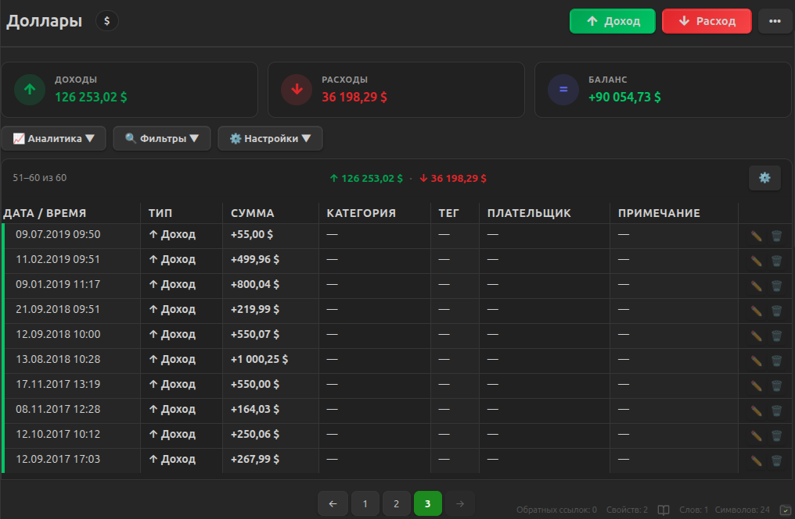

---

## Возможности

### Навигация по вкладкам
Счёт имеет четыре вкладки, переключаемые через меню `•••`:

- **Записи** — доходы и расходы
- **Долги** — долговые обязательства
- **Кредиты** — кредиты и графики платежей
- **Вклады** — депозиты с начислением процентов

### Счёт
| | |
|---|---|
| **Название** | Кликните на заголовок → редактируется inline |
| **Валюта** | Кликните на бейдж рядом с названием → выбор из списка или своя |

### Записи
- Обязательное поле — только **Сумма**
- **Дата** и **Время** рядом
- **Умное автозаполнение**: при вводе категории или плательщика автоматически подставляются сумма, тег и второе поле из последней совпадающей записи (появляется бейдж «✨ данные подставлены»)
- **Примечание** — визуально выделено цветом акцента
- **Внутренние операции**: кнопка 🔄 в поле «Плательщик» помечает запись как внутреннюю — она не учитывается в статистике. Фильтр «Внутренние» позволяет показать только такие записи.
- **Калькулятор**: кнопка 🧮 в поле суммы открывает встроенный калькулятор

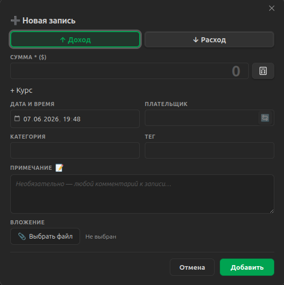

### Таблица
- На десктопе — полноценная таблица с закреплённым заголовком
- На мобильном — каждая запись отображается как карточка с подписями полей
- **Настройка колонок**: скрытие/отображение колонок через меню ⚙️

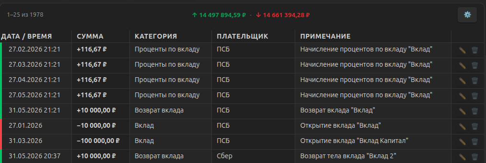
<br>
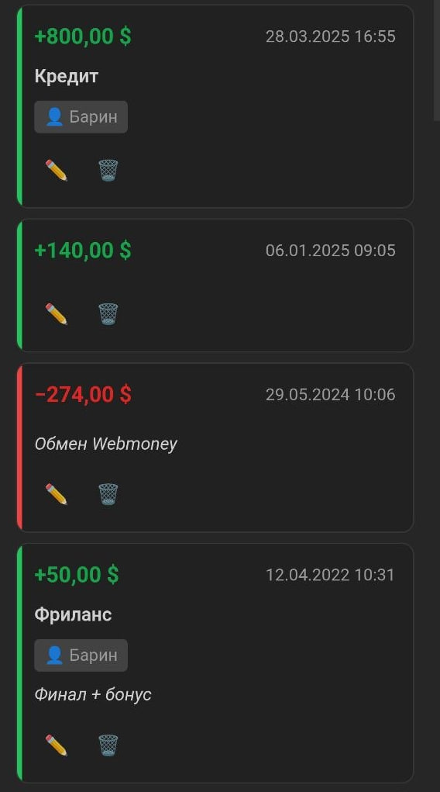

### Фильтры и сортировка
- Поиск по всем полям
- Фильтр по типу (доход/расход), категории, тегу, плательщику, датам
- Сортировка по дате, сумме, категории, дате добавления
- Состояние фильтров сохраняется для каждой заметки

<!--  -->

### Аналитика
- Статистика: доходы, расходы, баланс (с учётом долгов)
- Графики по категориям и месяцам

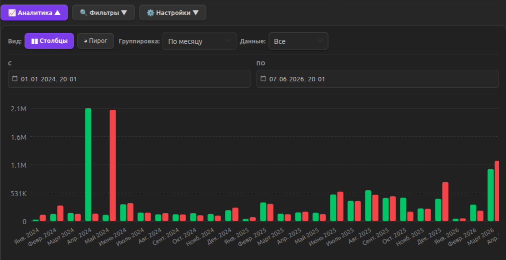
<br>
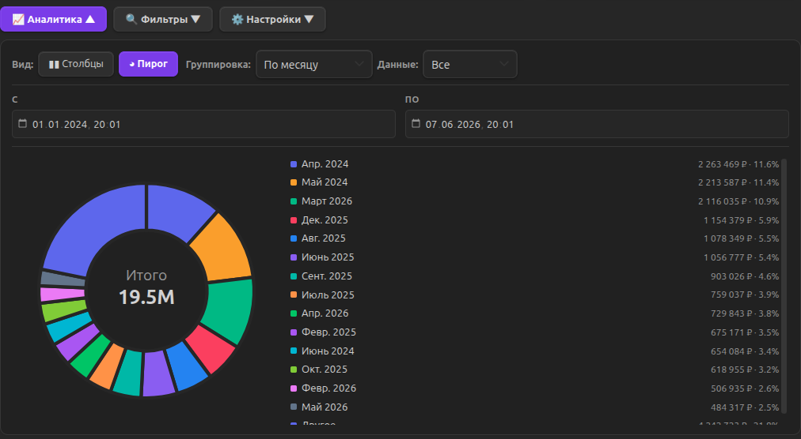

### Вложения
- Фото чеков и документов
- Прикрепляются к записи и открываются в Obsidian

### Импорт / Экспорт
**Экспорт:** CSV, JSON, XML

**Импорт:**
1. Выберите файл (.csv / .json / .xml)
2. Для JSON — укажите путь к массиву (напр. `data.records`)
3. Для XML — укажите тег записи (автоопределяется)
4. Настройте соответствие полей файла ↔ полям счёта
5. Укажите как определять тип: по полю, по знаку суммы, или все доходы/расходы
6. Нажмите «Импортировать»

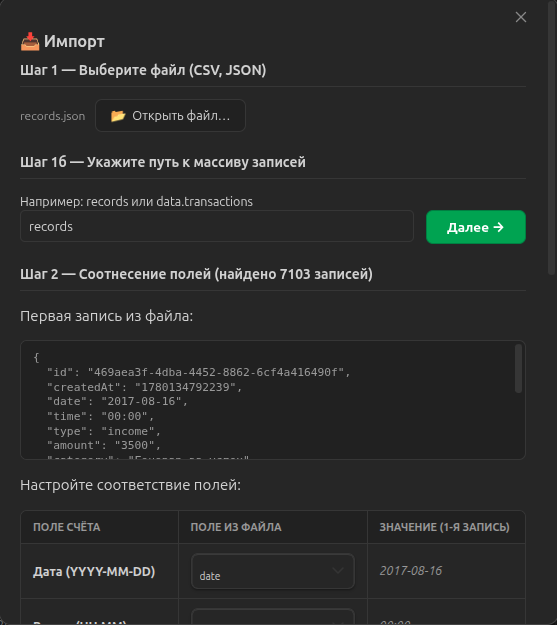
<br>
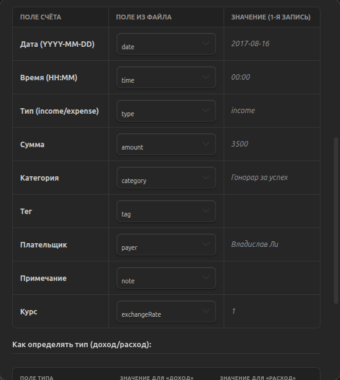
<br>
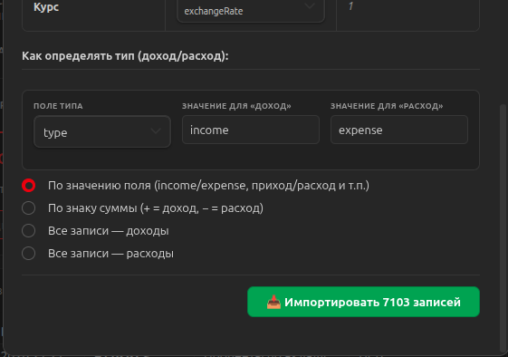

### Долги
- Два направления: «Мне должны» (lent) и «Я должен» (borrowed)
- Отслеживание платежей: занял → погасил
- Автоматический расчёт остатка
- Процентная ставка и дата возврата
- Фильтры по статусу (погашен/не погашен), направлению, человеку, датам
- История движений по каждому долгу

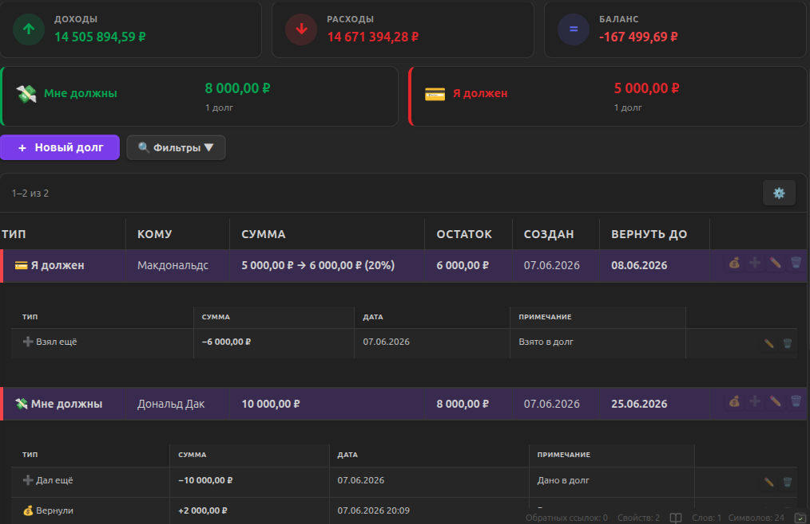
<br>
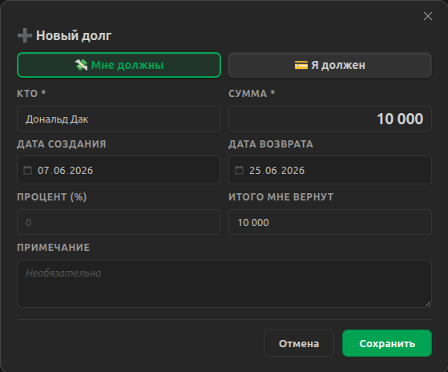

### Кредиты
- Типы: потребительский, автокредит, ипотека
- График ежемесячных платежей
- Автоматическое создание платежей и записей о расходах
- Досрочное погашение (с уменьшением суммы или срока)
- Отслеживание статуса: активен / погашен

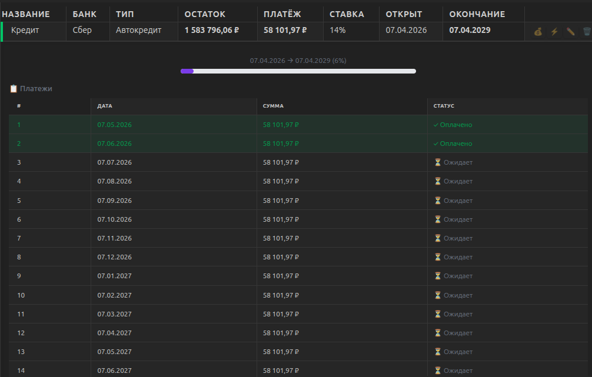
<br>
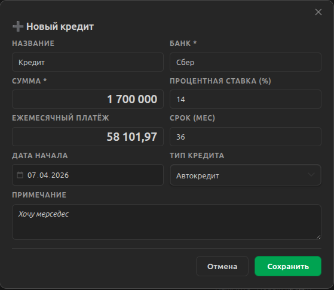
<br>
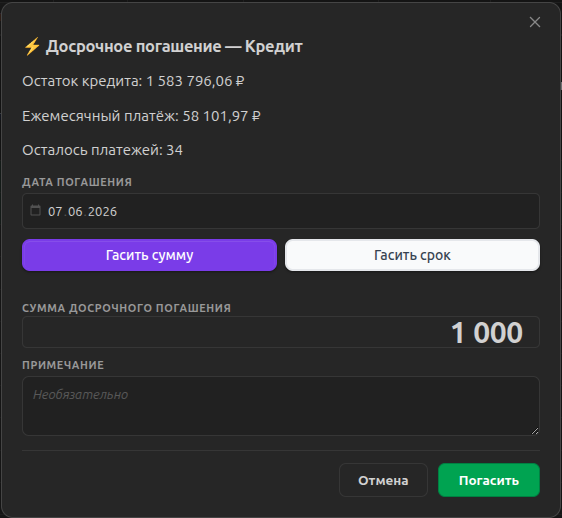

### Вклады
- Типы: срочный, до востребования, накопительный
- Автоматический расчёт ежемесячных процентов
- Тип начисления: на счёт или с капитализацией
- Пополнения и частичные снятия
- Автоматическое создание записей о доходах при начислении процентов
- Автоматическое закрытие вклада по окончании срока

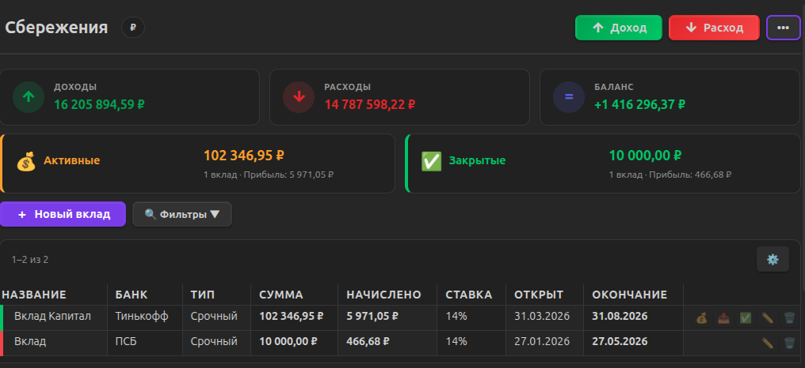
<br>
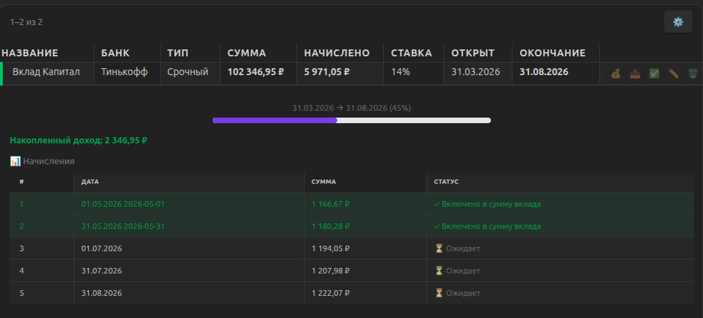
<br>
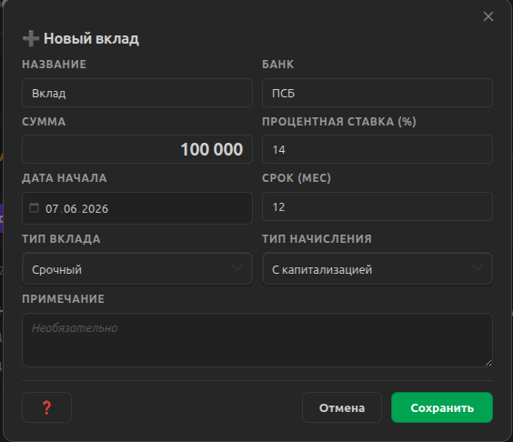

### Настройки плагина
- **Валюта по умолчанию** для новых счетов
- **Управление валютами**: добавление, удаление, сортировка валют drag-and-drop
- **Количество записей на странице**

---

## Структура данных

Данные хранятся в `.obsidian/plugins/obsidian-finance/accounts/` в отдельных файлах для каждого счёта:

```
.obsidian/plugins/obsidian-finance/accounts/
  Finance_Accounts_Наличные.md/
    meta.json       # название, валюта, цвет акцента
    records.json    # записи доходов/расходов
    debts.json      # долги
    credits.json    # кредиты
    deposits.json   # вклады
```

### meta.json
```json
{
  "version": 4,
  "name": "Карта Сбербанка",
  "currency": "₽",
  "accentColor": "#7c3aed"
}
```

### records.json
```json
{
  "version": 4,
  "records": [
    {
      "id": "uuid",
      "createdAt": 1700000000000,
      "date": "2024-11-15",
      "time": "14:30",
      "type": "expense",
      "amount": 1500.00,
      "category": "Продукты",
      "tag": "еда",
      "payer": "Иван",
      "note": "Магнит",
      "attachmentPath": "",
      "isInternal": false
    }
  ],
  "categories": ["Продукты", "Транспорт"],
  "tags": ["еда"],
  "payers": ["Иван"]
}
```

---

## Разработка

```bash
npm run dev     # Режим разработки (watch)
npm run build   # Сборка в dist/
npm test        # Unit тесты
npm run lint    # Проверка ESLint
```

---

## Дорожная карта

- [x] CRUD записей с датой и временем
- [x] Редактирование названия счёта inline
- [x] Валюта для каждого счёта
- [x] Фильтры и сортировка с сохранением
- [x] Пагинация
- [x] Статистика (доходы/расходы/баланс)
- [x] Умное автозаполнение
- [x] Вложения (фото чеков)
- [x] Импорт CSV/JSON/XML с маппингом полей
- [x] Экспорт CSV/JSON/XML
- [x] Адаптивный вид для мобильных
- [x] Система долгов
- [x] Аналитика с графиками
- [x] Мультиязычность (RU/EN)
- [x] Внутренние операции (исключение из статистики)
- [x] Управление кредитами
- [x] Управление вкладами
- [x] Автоматические начисления по вкладам и платежи по кредитам
- [x] Настройка колонок таблиц
- [x] Встроенный калькулятор

---

## Лицензия

MIT
